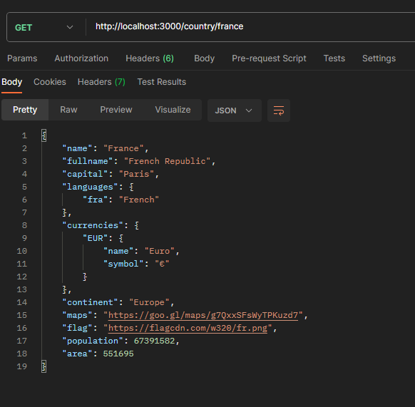

# API Countries

## Description
API Countries provides data such as capital, population, currency, and continent of a country. This API is built upon the REST Countries API, which is accessible at [https://restcountries.com/](https://restcountries.com/). It serves as a convenient wrapper, allowing easy access to country-related information through a standardized API interface.

## Installation
To get started with the API, follow these steps:
1. Clone the project: `git clone ...`
2. Navigate to the root directory of the project.
3. Install dependencies: `npm install`
4. Start the server using nodemon: `npm start`

The API will be running and accessible at port 3000.

## Usage
The API documentation can be found at [http://localhost:3000/api_doc](http://localhost:3000/api_doc). It outlines all available endpoints and how to interact with them.

### Example
Here's an example of retrieving country data using the `/country` route:

## Technologies Used
- TypeScript: TypeScript is used for developing the API, providing enhanced features and static type-checking capabilities.

## Contributors
- [Bem BOLA](https://github.com/bem-bola)
